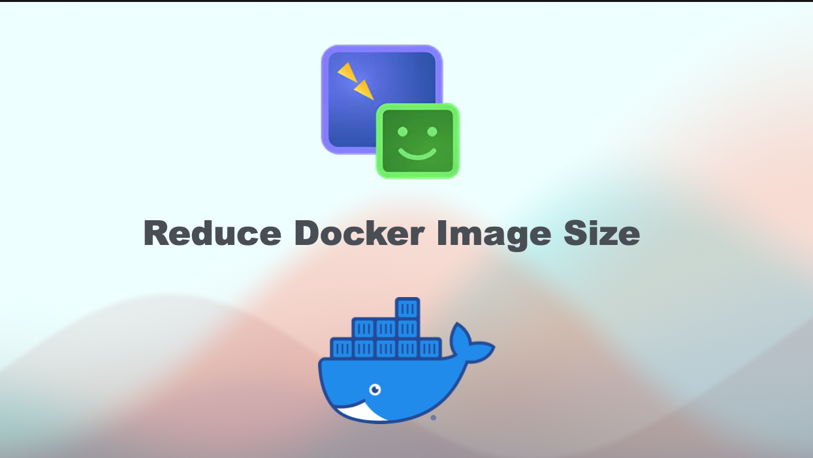

# 🚀 Reduce Docker Image Size
[](https://www.linkedin.com/in/amine-maalej/)

[](https://www.youtube.com/@CloudTech_with_Amine)





## 🌟 Overview
In this guide, I’ll reveal the hidden optimization techniques top DevOps teams use to shrink Docker images for lightning-fast deployments and reduced storage costs. You’ll learn step-by-step how to go from bloated images to sleek, efficient builds — the kind that can take a Python-based machine learning application from 1.2GB down to a stunning 8MB.
- **Proven techniques to strip down Docker images and free up disk space**
- **Optimization strategies that boost your application’s startup speed**
- **Real-world case study: How we shrank a Docker image by 99%**

## 📝 Comprehensive Guide
For a detailed guide, please refer to the [Youtube video](https://www.youtube.com/watch?v=Kmc0jj-5elE).

## ✅ Slides

Slide 1            | Slide 2         | Slide 3        | Slide 4
:------------------------:|:-----------------------:|:----------------------:|:----------------------:
  |  |  | 


Slide 5            | Slide 6         | Slide 7        | Slide 8
:------------------------:|:-----------------------:|:----------------------:|:----------------------:
  |  |  | 


Slide 9            | Slide 10         | Slide 11        | Slide 12 | Slide 13
:------------------------:|:-----------------------:|:----------------------:|:----------------------: |:----------------------:
  |  |  |  | 

## 💻 Commands

### Layer Optimization: Every Byte Counts

```
RUN apt-get update && apt-get install -y python3-pip python3-dev && \
    pip3 install numpy pandas && \
    apt-get clean && rm -rf /var/lib/apt/lists/*
```

### Use Docker Buildkit

```
DOCKER_BUILDKIT=1 docker build -t myapp . 
```

### Always Run Containers as Non-Root Users

```
RUN adduser --disabled-password --gecos "" appuser
USER appuser
```

### Limit the network exposure of your container by restricting the ports and IP addresses

```
docker run -p 127.0.0.1:8080:8080 myimage 
```

### Regularly scan your Docker images for known vulnerabilities

```
docker scan your-image:tag
```

## 🔗 Links
### Scratch Image

```
https://hub.docker.com/_/scratch
```

### Google Distroless Images

```
https://github.com/GoogleContainerTools/distroless
```
### Docker BuildKit

```
https://docs.docker.com/build/buildkit/
```

### Image Analysis Tools

```
https://github.com/wagoodman/dive
```
```
https://github.com/slimtoolkit/slim
```
```
https://github.com/aquasecurity/trivy
```

Happy learning 📚


